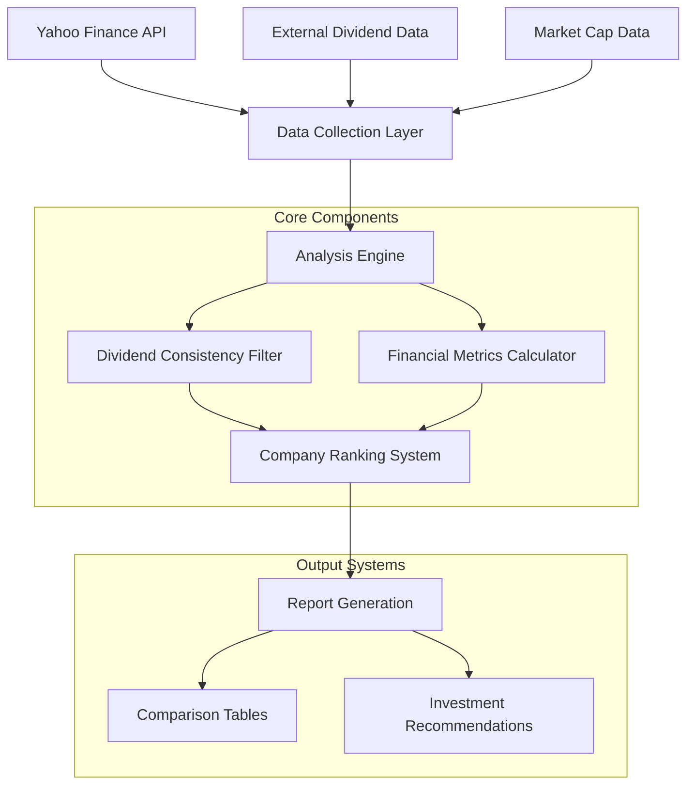
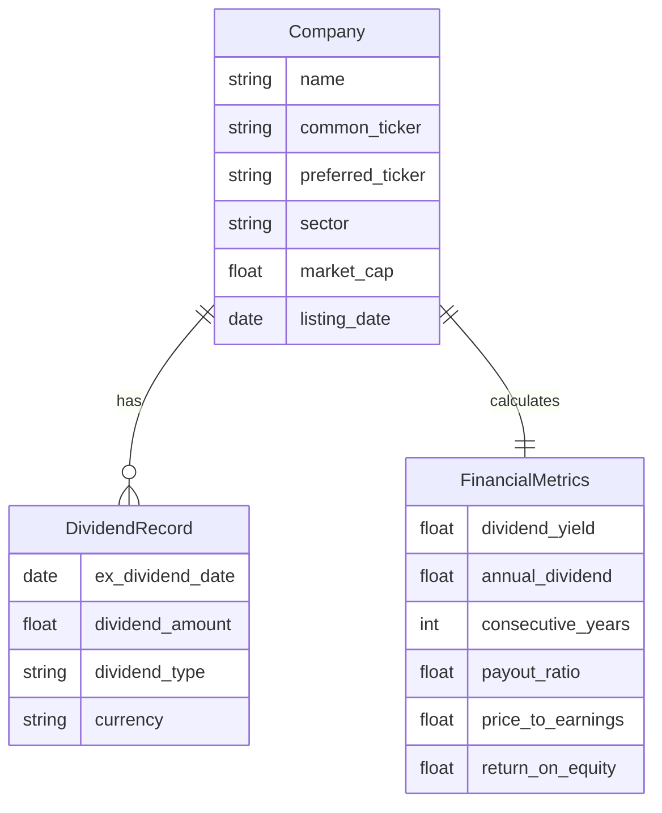
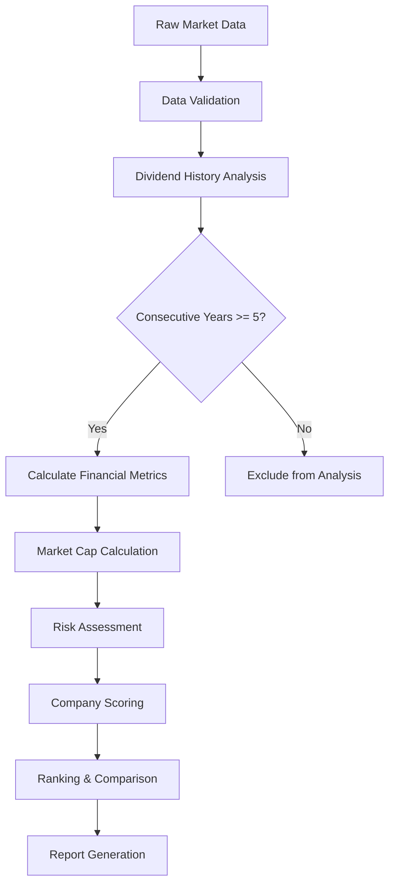
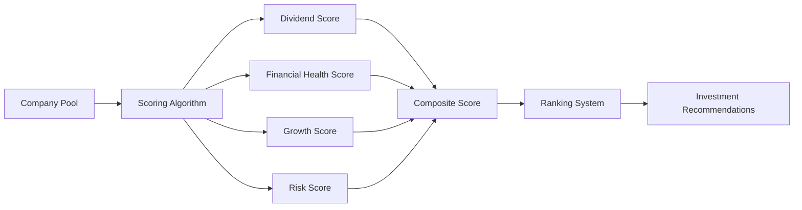
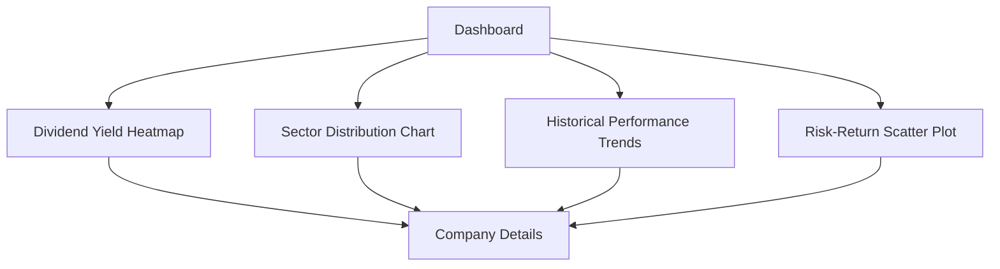

# Korean Dividend Analysis System Design

## 1. Overview

The Korean Dividend Analysis System is designed to identify and analyze companies with consistent dividend payments in the Korean stock market. The system focuses on finding companies that have maintained dividend payments for at least 5 consecutive years and provides comprehensive comparison capabilities between companies based on dividend rates, stock prices, and market capitalization.

### Current System Analysis

The existing codebase demonstrates sophisticated financial analysis capabilities with multiple variations of backtesting strategies, particularly focused on preferred stock vs common stock arbitrage for companies like Samsung Electronics. The system has evolved through multiple iterations, from simple 5-year analyses to comprehensive 30-year backtesting with sliding window approaches.

### Core Objectives

- Identify companies with 5+ consecutive years of dividend payments
- Create comprehensive comparison tables for investment decision-making
- Provide detailed analysis of dividend yields, stock performance, and market metrics
- Support both common and preferred stock analysis for comprehensive evaluation

## 2. Architecture

### System Architecture Overview

### Component Architecture

The system builds upon existing infrastructure with these key components:

#### Data Collection Infrastructure
- **Multi-source Integration**: Combines yfinance API data with external dividend sources
- **Efficient Caching**: Utilizes existing JSON-based data persistence for performance
- **Incremental Updates**: Smart update mechanism to avoid redundant data fetching

#### Analysis Framework
- **Dividend Consistency Engine**: Analyzes payment history to identify qualifying companies
- **Financial Metrics Calculator**: Computes comprehensive financial indicators
- **Ranking Algorithm**: Multi-criteria scoring system for investment prioritization

#### Reporting System
- **Dynamic Table Generation**: Creates sortable comparison tables
- **Visualization Engine**: Generates charts and graphs for trend analysis
- **Export Capabilities**: Supports multiple output formats (Markdown, CSV, JSON)

## 3. Data Models & Processing Pipeline

### Company Data Structure

### Data Processing Workflow

### Dividend Consistency Analysis Algorithm

The system implements a sophisticated algorithm to identify companies with consistent dividend payments:

1. **Historical Data Collection**: Gather 10+ years of dividend data for comprehensive analysis
2. **Consecutive Year Detection**: Identify unbroken chains of annual dividend payments
3. **Payment Pattern Analysis**: Analyze quarterly/semi-annual payment consistency
4. **Growth Trend Evaluation**: Assess dividend growth sustainability

## 4. Core Features & Functionality

### Dividend Consistency Filter

**Primary Feature**: Identify companies with 5+ consecutive years of dividend payments

**Algorithm Components**:
- **Timeline Analysis**: Examine dividend payment history with gap detection
- **Payment Frequency Recognition**: Support quarterly, semi-annual, and annual patterns
- **Growth Rate Calculation**: Measure dividend growth consistency over time
- **Sustainability Assessment**: Evaluate financial health to predict future payments

### Financial Metrics Calculator

**Comprehensive Metrics Suite**:

| Metric Category | Specific Indicators |
|-----------------|-------------------|
| **Dividend Metrics** | Dividend Yield, Annual Dividend, Dividend Growth Rate, Payout Ratio |
| **Valuation Metrics** | Market Cap, P/E Ratio, P/B Ratio, EV/EBITDA |
| **Performance Metrics** | ROE, ROA, Debt-to-Equity, Current Ratio |
| **Risk Metrics** | Beta, Volatility, Sharpe Ratio, Maximum Drawdown |

### Company Comparison Engine

**Multi-dimensional Comparison Framework**:

### Investment Decision Support

**Ranking Criteria**:
1. **Dividend Reliability Score** (40% weight)
   - Consecutive payment years
   - Payment growth consistency
   - Payout ratio sustainability

2. **Financial Strength Score** (30% weight)
   - Market capitalization
   - Debt levels
   - Profitability metrics

3. **Growth Potential Score** (20% weight)
   - Revenue growth
   - Dividend growth rate
   - Market position

4. **Risk Assessment Score** (10% weight)
   - Stock volatility
   - Sector stability
   - Economic sensitivity

## 5. User Interface & Reporting

### Interactive Company Comparison Table

The system generates comprehensive comparison tables with the following structure:

| 회사명 | 연속배당년수 | 배당수익률 | 현재주가 | 시가총액 | 섹터 | 투자등급 | 상세분석 |
|--------|------------|-----------|----------|----------|------|----------|----------|
| Samsung Electronics | 8년 | 2.85% | ₩71,000 | ₩426조원 | 반도체 | A+ | [링크] |
| LG Chem | 6년 | 1.95% | ₩415,000 | ₩29조원 | 화학 | A | [링크] |

### Advanced Filtering & Sorting

**Filter Options**:
- Minimum consecutive dividend years (5, 7, 10+)
- Sector classification
- Market cap ranges (대형주, 중형주, 소형주)
- Dividend yield thresholds
- Investment grade ratings

**Sorting Capabilities**:
- Dividend yield (high to low)
- Consecutive years (longest first)
- Market cap (largest first)
- Composite investment score
- Sector-based grouping

### Visual Analytics Dashboard

## 6. Implementation Strategy

### Phase 1: Data Infrastructure Enhancement
- Extend existing PREFERRED_STOCK_COMPANIES database
- Implement comprehensive Korean market company coverage
- Enhance data collection for market cap and financial metrics

### Phase 2: Analysis Engine Development
- Build dividend consistency detection algorithm
- Implement multi-criteria scoring system
- Create automated ranking mechanism

### Phase 3: Reporting & Visualization
- Develop interactive comparison tables
- Implement chart generation for trend analysis
- Create exportable report formats

### Phase 4: Advanced Features
- Add real-time data updates
- Implement alert system for dividend announcements
- Create portfolio optimization recommendations

## 7. Technical Specifications

### Data Sources Integration

| Source | Data Type | Update Frequency | Format |
|--------|-----------|------------------|---------|
| Yahoo Finance (yfinance) | Stock prices, basic dividends | Daily | JSON/API |
| External Dividend Sources | Detailed dividend history | Manual/Quarterly | JSON |
| Market Data Providers | Market cap, financial ratios | Daily | API |
| Company Reports | Financial statements | Quarterly | Structured data |

### Performance Optimization

**Caching Strategy**:
- Daily price data: 24-hour cache
- Dividend history: 7-day cache for recent data, permanent for historical
- Financial metrics: Weekly refresh
- Market cap data: Daily updates

**Parallel Processing**:
- Multi-threaded company analysis
- Batch API calls for efficiency
- Asynchronous data updates

### Error Handling & Data Quality

**Data Validation Framework**:
- Dividend amount reasonableness checks
- Date consistency validation
- Cross-source data verification
- Missing data interpolation strategies

**Fallback Mechanisms**:
- Multiple data source redundancy
- Historical data restoration
- Manual data entry capabilities
- Data quality scoring system

## 8. Testing Strategy

### Unit Testing Framework
- Individual metric calculation validation
- Dividend consistency algorithm testing
- Ranking system verification
- Data processing pipeline tests

### Integration Testing
- End-to-end data flow validation
- Multi-source data consistency checks
- Report generation accuracy verification
- Performance benchmarking

### User Acceptance Testing
- Investment professional review
- Comparison with established investment tools
- Accuracy validation against known dividend aristocrats
- Usability testing for table interfaces