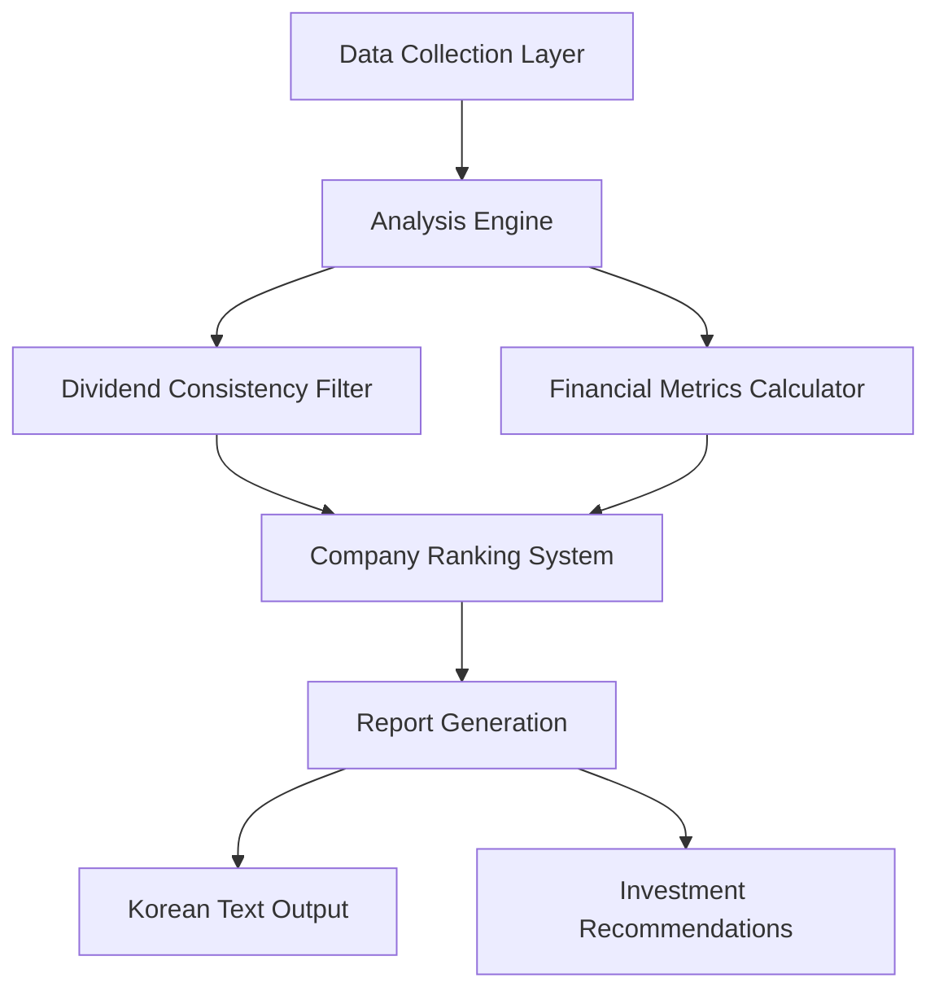

# Project Overview

## 📋 System Architecture

The Korean Dividend Analysis System follows a **script-based batch processing architecture** designed to analyze Korean stock market dividend patterns.

### Core Components

### Key Features

- **5+ Year Dividend Analysis**: Identifies companies with consistent dividend payments
- **Korean Text Support**: Full Malgun Gothic font integration
- **Multi-Stock Analysis**: Both common and preferred stock evaluation  
- **Investment Scoring**: Comprehensive ranking system based on multiple criteria
- **Real-time Data**: Yahoo Finance API integration for current market data

## 🏗️ Technical Architecture

### Design Patterns Used
- **Modular Scripting Pattern**: Self-contained analysis modules
- **Template Method Pattern**: Common analysis steps abstracted
- **Command Pattern**: PowerShell/Makefile command encapsulation
- **File-based Pipeline**: JSON/CSV data flow

### Technology Stack
- **Python 3.12+**: Core analysis language
- **yfinance**: Stock data retrieval  
- **pandas/numpy**: Data manipulation
- **matplotlib/seaborn**: Korean-text visualization
- **uv**: Modern Python package management

## 📊 Business Value

### Problem Solved
- Difficulty identifying reliable Korean dividend stocks
- Lack of Korean language financial analysis tools
- Need for systematic dividend consistency evaluation
- Complex comparison of common vs preferred stocks

### Value Delivered  
- **Automated Screening**: 21+ Korean companies analyzed automatically
- **Investment Grades**: A+ to C rating system for easy decision making
- **Korean Localization**: Native language support for Korean investors
- **Comprehensive Metrics**: Dividend yield, growth rates, market cap analysis

## 🎯 Use Cases

### Primary Users
1. **Individual Investors**: Korean dividend stock screening
2. **Financial Analysts**: Systematic market analysis  
3. **Investment Advisors**: Client recommendation generation
4. **Academic Researchers**: Korean market dividend studies

### Analysis Scenarios
- **Long-term Investment**: 5+ year dividend consistency screening
- **Sector Analysis**: Industry-specific dividend performance
- **Risk Assessment**: Investment grade-based portfolio allocation
- **Preferred Stock Arbitrage**: Common vs preferred stock comparison

## 📈 System Capabilities

### Analysis Depth
- **Historical Analysis**: Up to 10+ years of dividend history
- **Real-time Pricing**: Current market valuations
- **Growth Calculations**: Dividend growth rate analysis
- **Market Cap Assessment**: Company size-based categorization

### Output Formats
- **Interactive Tables**: Sortable comparison matrices
- **Investment Reports**: PDF/Markdown formatted analysis
- **Visualization Charts**: Korean-labeled graphs and plots
- **JSON Data Export**: Structured data for further processing

## 🔄 Integration Points

### Data Sources
- **Yahoo Finance**: Primary stock and dividend data
- **Korean Exchange**: Market-specific information
- **Company Reports**: Supplementary financial data

### Export Capabilities  
- **Excel Integration**: CSV export for spreadsheet analysis
- **Database Storage**: JSON format for system integration
- **Reporting Systems**: Markdown for documentation
- **Visualization Tools**: PNG charts with Korean text support

This architecture ensures reliable, scalable, and culturally appropriate financial analysis for the Korean market.