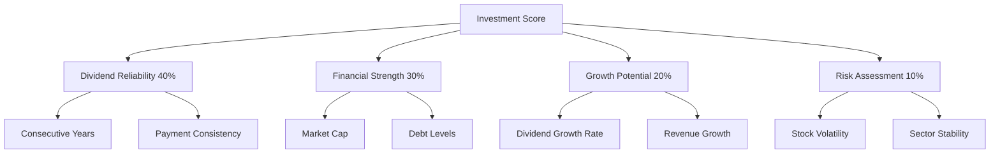
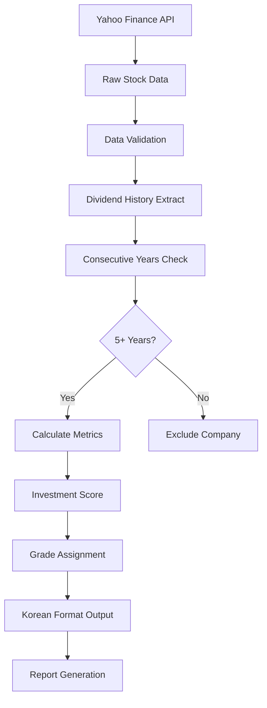

# Core Concepts and Business Logic

## 📊 Dividend Analysis Fundamentals

### Consecutive Dividend Years Algorithm

The core concept of this system is identifying companies with **5+ consecutive years** of dividend payments. This indicates financial stability and management commitment to shareholder returns.

```python
def check_consecutive_dividend_years(dividends, min_years=5):
    """
    Algorithm for detecting consecutive dividend payments:
    1. Group dividends by year
    2. Filter out years with zero dividends  
    3. Find longest consecutive sequence
    4. Validate against minimum years threshold
    """
    yearly_dividends = dividends.groupby(dividends.index.year).sum()
    yearly_dividends = yearly_dividends[yearly_dividends > 0]
    
    # Consecutive year detection logic
    years = sorted(yearly_dividends.index)
    consecutive_count = 1
    max_consecutive = 1
    
    for i in range(1, len(years)):
        if years[i] == years[i-1] + 1:
            consecutive_count += 1
            max_consecutive = max(max_consecutive, consecutive_count)
        else:
            consecutive_count = 1
            
    return max_consecutive >= min_years
```

### Investment Scoring System

The system uses a **multi-criteria evaluation** approach to rank companies:



#### Scoring Formula
```python
def calculate_investment_score(company_results):
    score = 0
    common_stock = company_results['common_stock']
    
    # 1. Dividend Reliability (40% weight)
    consecutive_years = common_stock['consecutive_years']
    score += min(consecutive_years * 4, 40)
    
    # 2. Dividend Yield (30% weight)  
    dividend_yield = common_stock['dividend_yield']
    yield_score = min(dividend_yield * 6, 30)
    score += yield_score
    
    # 3. Market Cap Stability (20% weight)
    market_cap = common_stock['market_cap']
    if market_cap > 10_000_000_000_000:      # 10조원+
        score += 20
    elif market_cap > 1_000_000_000_000:     # 1조원+
        score += 15
    elif market_cap > 100_000_000_000:       # 1000억원+
        score += 10
        
    # 4. Dividend Growth (10% weight)
    growth_rate = common_stock['dividend_growth_rate']
    if growth_rate > 5:
        score += 10
    elif growth_rate > 0:
        score += 5
        
    return min(score, 100)
```

## 🏢 Korean Market Specifics

### Stock Exchange Integration

The system specifically targets **Korean Stock Exchange (KRX)** listed companies:

- **Ticker Format**: 6-digit code + ".KS" suffix
- **Examples**: 005930.KS (삼성전자), 051910.KS (LG화학)
- **Dual Listings**: Common and Preferred stock analysis
- **Currency**: Korean Won (KRW) with proper formatting

### Preferred vs Common Stock Analysis

```python
KOREAN_DIVIDEND_COMPANIES = {
    '삼성전자': {
        'common': '005930.KS',     # 보통주
        'preferred': '005935.KS',   # 우선주  
        'sector': '전자/반도체'
    }
    # ... additional companies
}
```

#### Analysis Logic
1. **Parallel Analysis**: Both stock types analyzed simultaneously
2. **Comparison Metrics**: Dividend yield, price premium/discount
3. **Investment Strategy**: Optimal stock type recommendation
4. **Risk Assessment**: Liquidity and volatility comparison

### Korean Business Sectors

| 섹터 (Sector) | 영문명 | 주요 기업 | 특성 |
|---------------|--------|----------|------|
| 전자/반도체 | Electronics/Semiconductor | 삼성전자, SK하이닉스 | 고성장, 기술집약 |
| 자동차 | Automotive | 현대자동차, 기아 | 글로벌 수출, 경기민감 |
| 화학 | Chemical | LG화학, 롯데케미칼 | 원자재 민감, 안정배당 |
| 통신 | Telecommunications | SKT, KT, LG유플러스 | 안정수익, 높은배당 |
| 담배 | Tobacco | KT&G | 독점적 지위, 초고배당 |

## 💹 Financial Metrics Calculation

### Dividend Yield Calculation
```python
def calculate_dividend_yield(annual_dividend, current_price):
    """
    배당수익률 = (연간 배당금 / 현재 주가) × 100
    
    Example:
    - 삼성전자 연간배당: 1,456원
    - 현재주가: 67,600원  
    - 배당수익률: (1,456 / 67,600) × 100 = 2.15%
    """
    return (annual_dividend / current_price * 100) if current_price > 0 else 0
```

### Dividend Growth Rate
```python
def calculate_dividend_growth_rate(yearly_dividends):
    """
    배당성장률 = 최근 3년간 연평균 성장률
    
    Formula: ((현재배당 / 3년전배당)^(1/3) - 1) × 100
    """
    if len(yearly_dividends) >= 3:
        recent_years = yearly_dividends.tail(3)
        growth_rates = []
        for i in range(1, len(recent_years)):
            if recent_years.iloc[i-1] > 0:
                growth_rate = (recent_years.iloc[i] - recent_years.iloc[i-1]) / recent_years.iloc[i-1] * 100
                growth_rates.append(growth_rate)
        return np.mean(growth_rates) if growth_rates else 0
    return 0
```

### Market Capitalization Formatting
```python
def format_market_cap(market_cap):
    """
    한국식 시가총액 표시:
    - 1조원 이상: X.X조원
    - 1000억~1조: X.X천억원  
    - 100억~1000억: XX백억원
    - 100억 미만: XX억원
    """
    if market_cap >= 1_000_000_000_000:
        return f"{market_cap/1_000_000_000_000:.1f}조원"
    elif market_cap >= 100_000_000_000:
        return f"{market_cap/100_000_000_000:.1f}천억원"
    elif market_cap >= 10_000_000_000:
        return f"{market_cap/10_000_000_000:.0f}백억원"
    else:
        return f"{market_cap/100_000_000:.0f}억원"
```

## 🎯 Investment Grade Classification

### Grade Definition
```python
def get_investment_grade(score):
    """
    투자등급 분류:
    A+: 90점 이상 - 최우수 배당주
    A:  80~89점  - 우수 배당주
    B+: 70~79점  - 양호 배당주  
    B:  60~69점  - 보통 배당주
    C+: 50~59점  - 주의 배당주
    C:  50점 미만 - 투자부적합
    """
    if score >= 90: return 'A+'
    elif score >= 80: return 'A'
    elif score >= 70: return 'B+'
    elif score >= 60: return 'B'
    elif score >= 50: return 'C+'
    else: return 'C'
```

### Grade Interpretation

| 등급 | 점수범위 | 투자권고 | 특성 |
|------|----------|----------|------|
| **A+** | 90-100점 | 강력매수 | 장기안정배당, 높은수익률 |
| **A** | 80-89점 | 매수 | 안정적배당, 성장가능성 |
| **B+** | 70-79점 | 보유 | 양호한배당, 일부위험 |
| **B** | 60-69점 | 중립 | 평균적배당, 주의관찰 |
| **C+** | 50-59점 | 주의 | 불안정배당, 위험증가 |
| **C** | <50점 | 매도 | 배당중단위험, 투자부적합 |

## 🔄 Data Pipeline Architecture

### Data Flow Process


### Error Handling Strategy
```python
def robust_data_collection(ticker):
    """
    안정적 데이터 수집 전략:
    1. Primary: Yahoo Finance API
    2. Fallback: Alternative data sources
    3. Cache: Local data storage
    4. Validation: Data quality checks
    """
    try:
        # Primary data source
        stock = yf.Ticker(ticker)
        data = stock.dividends
        
        if data.empty:
            # Fallback logic
            return get_cached_data(ticker)
            
        return validate_and_clean(data)
        
    except Exception as e:
        log_error(f"Data collection failed for {ticker}: {e}")
        return pd.Series(dtype=float)  # Return empty series
```

This core business logic ensures reliable, accurate, and culturally appropriate analysis of Korean dividend stocks.