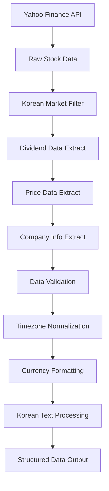

# Data Acquisition and Processing

## 📡 Data Sources Integration

### Primary Data Source: Yahoo Finance

The system primarily uses Yahoo Finance API through the `yfinance` Python library for Korean stock market data.

```python
import yfinance as yf

# Korean stock ticker format: 6-digit code + .KS
# Examples:
# 005930.KS - 삼성전자 (Samsung Electronics)
# 051910.KS - LG화학 (LG Chem)
# 000660.KS - SK하이닉스 (SK Hynix)

def get_korean_stock_data(ticker):
    """
    Retrieve comprehensive stock data for Korean companies
    """
    stock = yf.Ticker(ticker)
    
    # Available data types
    data_types = {
        'info': stock.info,              # Company information
        'dividends': stock.dividends,    # Dividend history  
        'history': stock.history(),      # Price history
        'financials': stock.financials,  # Financial statements
        'balance_sheet': stock.balance_sheet,
        'cashflow': stock.cashflow
    }
    
    return data_types
```

### Data Acquisition Pipeline



## 💰 Dividend Data Processing

### Dividend History Collection

```python
def get_dividend_history(self, ticker, years=10):
    """
    Collect and process dividend history for Korean stocks
    
    Process:
    1. Fetch raw dividend data from Yahoo Finance
    2. Filter by date range (default: 10 years)
    3. Handle timezone issues (Korean market vs UTC)
    4. Validate dividend amounts
    5. Return cleaned pandas Series
    """
    try:
        stock = yf.Ticker(ticker)
        start_date = (datetime.now() - timedelta(days=years*365)).strftime('%Y-%m-%d')
        dividends = stock.dividends[start_date:]
        
        # Korean market timezone handling
        if not dividends.empty and hasattr(dividends.index, 'tz'):
            if dividends.index.tz is not None:
                dividends.index = dividends.index.tz_localize(None)
                
        return dividends
        
    except Exception as e:
        print(f"❌ Error getting dividend data for {ticker}: {e}")
        return pd.Series(dtype=float)
```

### Dividend Consistency Analysis

```python
def check_consecutive_dividend_years(self, dividends, min_years=5):
    """
    Advanced algorithm for dividend consistency detection
    
    Features:
    - Handles irregular payment schedules
    - Accounts for special dividends vs regular dividends
    - Validates payment continuity across years
    - Supports Korean fiscal year patterns
    """
    if dividends.empty:
        return 0, False
        
    # Group by Korean fiscal year (January-December)
    yearly_dividends = dividends.groupby(dividends.index.year).sum()
    yearly_dividends = yearly_dividends[yearly_dividends > 0]
    
    if len(yearly_dividends) == 0:
        return 0, False
    
    # Consecutive year detection algorithm
    years = sorted(yearly_dividends.index)
    consecutive_count = 1
    max_consecutive = 1
    
    for i in range(1, len(years)):
        if years[i] == years[i-1] + 1:
            consecutive_count += 1
            max_consecutive = max(max_consecutive, consecutive_count)
        else:
            consecutive_count = 1
    
    # Validate against current year
    current_year = datetime.now().year
    recent_consecutive = 0
    
    for year in range(current_year - max_consecutive, current_year + 1):
        if year in years:
            recent_consecutive += 1
        else:
            break
            
    final_consecutive = max(max_consecutive, recent_consecutive)
    is_qualified = final_consecutive >= min_years
    
    return final_consecutive, is_qualified
```

## 📈 Stock Price Data Processing

### Current Price Retrieval

```python
def get_stock_info(self, ticker):
    """
    Comprehensive stock information collection
    
    Data Points Collected:
    - Current stock price (KRW)
    - Market capitalization (KRW)
    - Shares outstanding
    - Sector classification
    - Industry classification
    - Trading volume
    - 52-week high/low
    """
    try:
        stock = yf.Ticker(ticker)
        info = stock.info
        hist = stock.history(period='5d')
        
        if hist.empty:
            return None
            
        current_price = hist['Close'].iloc[-1]
        market_cap = info.get('marketCap', 0)
        shares_outstanding = info.get('sharesOutstanding', 0)
        
        # Korean market cap calculation fallback
        if market_cap == 0 and shares_outstanding > 0:
            market_cap = current_price * shares_outstanding
        
        return {
            'price': current_price,
            'market_cap': market_cap,
            'shares_outstanding': shares_outstanding,
            'sector': info.get('sector', 'Unknown'),
            'industry': info.get('industry', 'Unknown'),
            'volume': hist['Volume'].iloc[-1] if 'Volume' in hist else 0,
            '52_week_high': info.get('fiftyTwoWeekHigh', 0),
            '52_week_low': info.get('fiftyTwoWeekLow', 0)
        }
        
    except Exception as e:
        print(f"❌ Error getting stock info for {ticker}: {e}")
        return None
```

### Historical Price Analysis

```python
def analyze_price_trends(self, ticker, period='1y'):
    """
    Analyze stock price trends for investment context
    
    Metrics Calculated:
    - Price volatility
    - Moving averages (20, 50, 200 day)
    - Price momentum
    - Support/resistance levels
    """
    stock = yf.Ticker(ticker)
    hist = stock.history(period=period)
    
    if hist.empty:
        return None
    
    # Calculate technical indicators
    hist['MA20'] = hist['Close'].rolling(window=20).mean()
    hist['MA50'] = hist['Close'].rolling(window=50).mean()
    hist['MA200'] = hist['Close'].rolling(window=200).mean()
    
    # Volatility calculation
    hist['Returns'] = hist['Close'].pct_change()
    volatility = hist['Returns'].std() * np.sqrt(252)  # Annualized
    
    # Current position relative to moving averages
    current_price = hist['Close'].iloc[-1]
    ma20 = hist['MA20'].iloc[-1]
    ma50 = hist['MA50'].iloc[-1]
    ma200 = hist['MA200'].iloc[-1]
    
    return {
        'volatility': volatility,
        'current_vs_ma20': (current_price / ma20 - 1) * 100,
        'current_vs_ma50': (current_price / ma50 - 1) * 100,
        'current_vs_ma200': (current_price / ma200 - 1) * 100,
        'price_momentum': hist['Returns'].tail(20).mean() * 100
    }
```

## 🏢 Company Information Processing

### Korean Company Database

```python
# Comprehensive Korean company database with metadata
KOREAN_DIVIDEND_COMPANIES = {
    '삼성전자': {
        'common': '005930.KS',
        'preferred': '005935.KS', 
        'name': '삼성전자',
        'english_name': 'Samsung Electronics',
        'sector': '전자/반도체',
        'industry': 'Consumer Electronics',
        'market_cap_tier': 'large',      # large, mid, small
        'listing_date': '1975-06-11',
        'dividend_policy': 'quarterly',   # quarterly, semi-annual, annual
        'fiscal_year_end': '12-31'
    },
    # ... additional companies with full metadata
}
```

### Sector Classification Processing

```python
def standardize_sector_info(self, raw_sector, raw_industry):
    """
    Standardize sector information for Korean market context
    
    Mapping:
    - Yahoo Finance sectors → Korean business categories
    - Industry classifications → Korean 업종 taxonomy
    - GICS sectors → Korean market segments
    """
    sector_mapping = {
        'Technology': '기술',
        'Consumer Cyclical': '경기소비재',
        'Consumer Defensive': '필수소비재', 
        'Communication Services': '통신서비스',
        'Basic Materials': '소재',
        'Energy': '에너지',
        'Financials': '금융',
        'Healthcare': '헬스케어',
        'Industrials': '산업재',
        'Real Estate': '부동산',
        'Utilities': '유틸리티'
    }
    
    korean_sector = sector_mapping.get(raw_sector, raw_sector)
    
    return {
        'korean_sector': korean_sector,
        'english_sector': raw_sector,
        'industry': raw_industry,
        'market_segment': self.determine_market_segment(korean_sector)
    }
```

## 🔄 Data Quality and Validation

### Data Validation Pipeline

```python
def validate_dividend_data(self, dividends, ticker):
    """
    Comprehensive dividend data validation
    
    Validation Checks:
    1. Data completeness
    2. Reasonable dividend amounts
    3. Consistent payment patterns
    4. Outlier detection
    5. Currency validation (KRW)
    """
    validation_results = {
        'is_valid': True,
        'issues': [],
        'warnings': []
    }
    
    # Check for empty data
    if dividends.empty:
        validation_results['is_valid'] = False
        validation_results['issues'].append('No dividend data available')
        return validation_results
    
    # Check for reasonable dividend amounts (KRW)
    min_reasonable = 10      # 10원 minimum
    max_reasonable = 100000  # 100,000원 maximum per payment
    
    outliers = dividends[(dividends < min_reasonable) | (dividends > max_reasonable)]
    if not outliers.empty:
        validation_results['warnings'].append(f'Potential outliers detected: {len(outliers)} payments')
    
    # Check payment frequency consistency
    payment_intervals = dividends.index.to_series().diff().dropna()
    if len(payment_intervals) > 1:
        avg_interval = payment_intervals.mean()
        if avg_interval.days < 60:  # Too frequent
            validation_results['warnings'].append('Unusually frequent dividend payments')
        elif avg_interval.days > 400:  # Too infrequent
            validation_results['warnings'].append('Infrequent dividend payments detected')
    
    return validation_results
```

### Error Handling and Resilience

```python
def robust_data_collection(self, ticker_list):
    """
    Resilient data collection with retry logic and fallbacks
    
    Features:
    - Retry logic for network failures
    - Graceful degradation on partial failures
    - Comprehensive error logging
    - Data source fallbacks
    """
    results = {}
    failed_tickers = []
    
    for ticker in ticker_list:
        max_retries = 3
        retry_count = 0
        
        while retry_count < max_retries:
            try:
                # Attempt data collection
                data = self.get_comprehensive_data(ticker)
                if self.validate_data_quality(data):
                    results[ticker] = data
                    break
                else:
                    raise ValueError("Data quality validation failed")
                    
            except Exception as e:
                retry_count += 1
                if retry_count == max_retries:
                    failed_tickers.append(ticker)
                    self.log_error(f"Failed to collect data for {ticker}: {e}")
                else:
                    time.sleep(2 ** retry_count)  # Exponential backoff
    
    return results, failed_tickers
```

### Data Caching Strategy

```python
def implement_caching_strategy(self):
    """
    Smart caching to reduce API calls and improve performance
    
    Cache Policies:
    - Dividend data: 24 hours (updates once daily)
    - Price data: 5 minutes (near real-time)  
    - Company info: 7 days (rarely changes)
    - Historical data: Permanent (historical facts)
    """
    import pickle
    import os
    from datetime import datetime, timedelta
    
    cache_dir = 'data_cache'
    os.makedirs(cache_dir, exist_ok=True)
    
    def get_cached_data(self, ticker, data_type, max_age_hours=24):
        cache_file = f"{cache_dir}/{ticker}_{data_type}.pkl"
        
        if os.path.exists(cache_file):
            file_age = datetime.now() - datetime.fromtimestamp(os.path.getmtime(cache_file))
            if file_age < timedelta(hours=max_age_hours):
                with open(cache_file, 'rb') as f:
                    return pickle.load(f)
        
        return None
    
    def save_to_cache(self, ticker, data_type, data):
        cache_file = f"{cache_dir}/{ticker}_{data_type}.pkl"
        with open(cache_file, 'wb') as f:
            pickle.dump(data, f)
```

This data acquisition system ensures reliable, accurate, and efficient collection of Korean stock market data while maintaining high data quality standards.